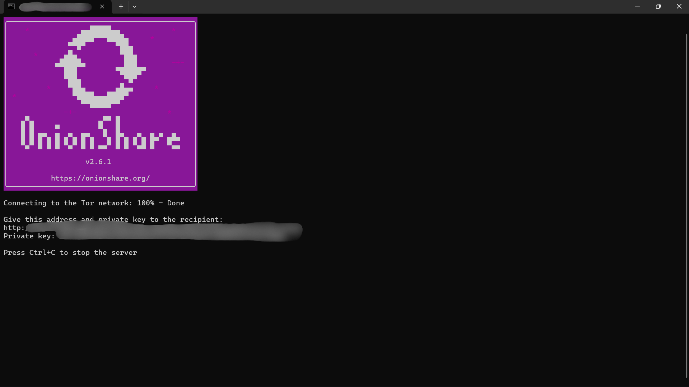
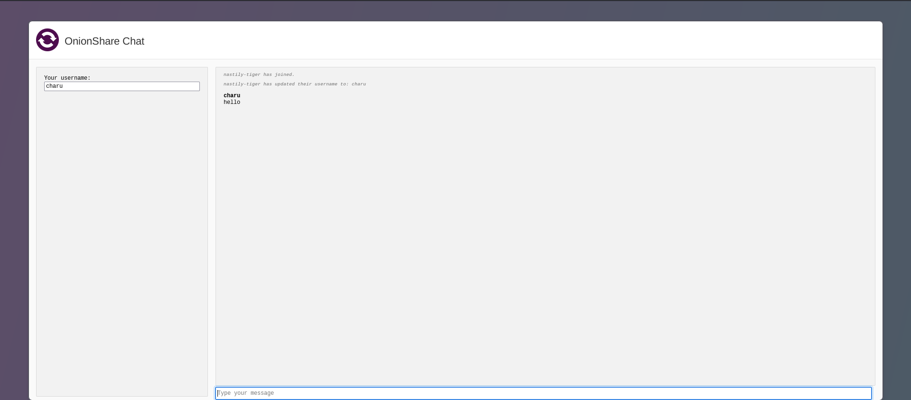

# **Secure Anonymous Chat on the Darknet using OnionShare & AWS**
 
## **Project Overview**
This project demonstrates how to set up a **secure, anonymous chat system** using **OnionShare** hosted on an **AWS instance** within the **Tor network**. The setup ensures **end-to-end encryption**, allowing users to communicate privately without third-party surveillance.

## **Features**
✔️ **Fully Anonymous** – No need for sign-ups or personal details.  
✔️ **End-to-End Encryption** – Secure communication over the **Tor network**.  
✔️ **Self-Destructing Chats** – Messages disappear when the session ends.  
✔️ **Darknet Hosting** – Runs as a `.onion` hidden service on AWS.  
✔️ **No Centralized Logging** – Ensuring **zero data retention**.  

## **Technologies Used**
- **OnionShare** – To create a temporary chat service.  
- **Tor Network** – Provides `.onion` anonymity.  
- **AWS EC2 (Ubuntu Server)** – For deploying the hidden service.  
- **Systemd Service** – Ensures **auto-start on reboot**.  

## **Setup Instructions**
### **1. Deploy an AWS Ubuntu Instance**
- Choose **Ubuntu 22.04 LTS** on AWS EC2.  
- Configure **Security Groups** to allow **Tor & SSH**.  

### **2. Install Tor & OnionShare**
```bash
sudo apt update
sudo apt install -y tor onionshare
```

### **3. Configure Tor Hidden Service**
1. Edit the Tor configuration:
   ```bash
   sudo nano /etc/tor/torrc
   ```
2. Add:
   ```
   HiddenServiceDir /var/lib/tor/hidden_service/
   HiddenServicePort 80 127.0.0.1:8080
   ```
3. Restart Tor:
   ```bash
   sudo systemctl restart tor
   ```

### **4. Start the Secure Chat**
```bash
onionshare --chat
```
Copy the **.onion URL** and open it in **Tor Browser**.

## **Security Considerations**
- 🔹 Use **Ephemeral AWS Instances** to minimize exposure.  
- 🔹 Ensure **Tor & OnionShare are updated** regularly.  
- 🔹 Avoid logging any metadata in AWS.  
- 🔹 Use **systemd** to ensure OnionShare stays online after reboot.  

## **Future Improvements**
- 📌 Integrate **custom front-end UI** for better user experience.  
- 📌 Automate deployment with **Terraform / Ansible**.  
- 📌 Implement **multi-user chatrooms** over the Tor network.  

## **License**
This project is for **educational and ethical hacking purposes only**. Use responsibly!
